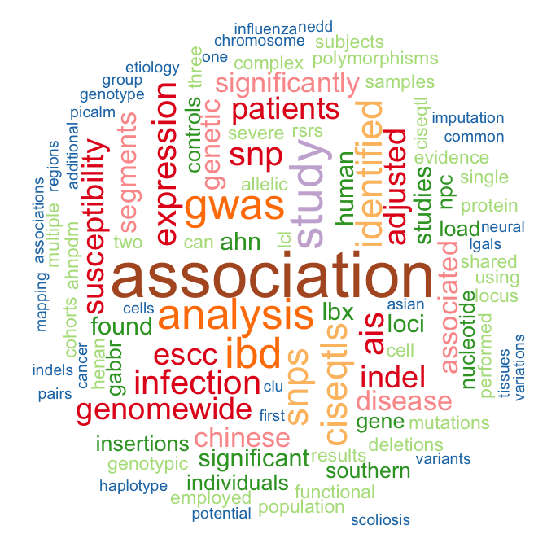

{{ site.about }}

***

I am a postdoctoral fellow in The University of Hong Kong.    

I am working in the field of human complex disease research, with specialization in bioinformatics and statistical genetics. My research includes genome wide association studies, exome sequencing, whole genome sequencing, RNA-seq, pathway analysis, candidate gene study, linkage analysis, machine learning, and software development. 

***

    

